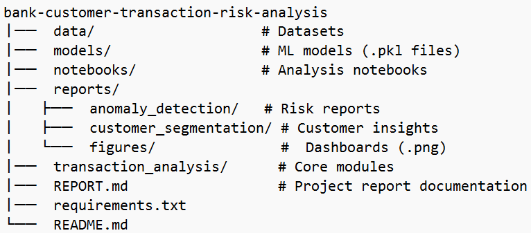
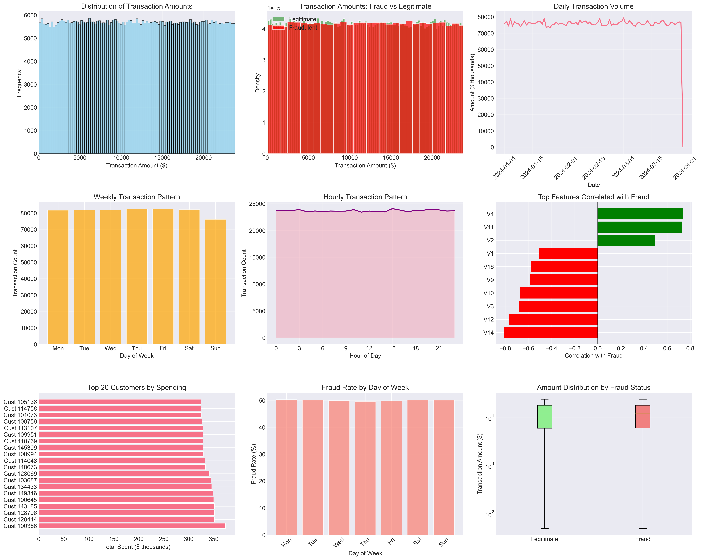
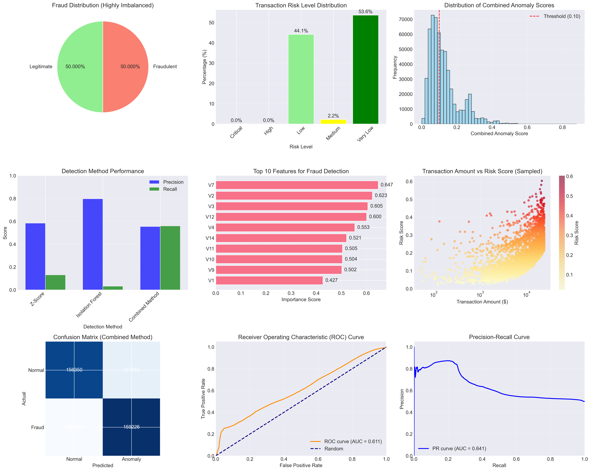
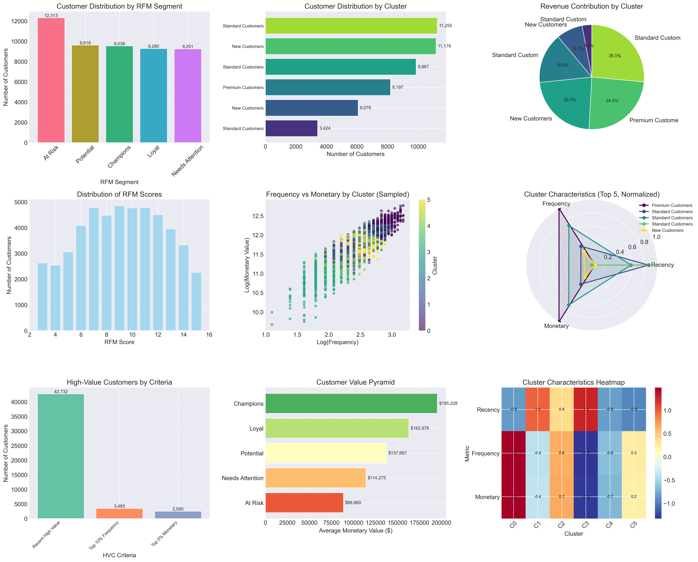
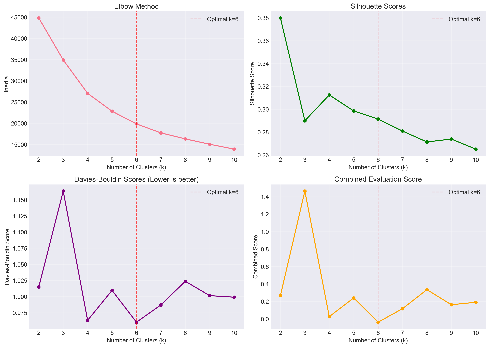

# COMPREHENSIVE BANKING RISK & CUSTOMER ANALYTICS REPORT
**Generated:** 2026-02-11  
**Data Source:** Credit Card Fraud Detection Dataset 2023  https://www.kaggle.com/datasets/nelgiriyewithana/credit-card-fraud-detection-dataset-2023  
**Project Directory:** `bank-customer-transaction-risk-analysis`

---

##  EXECUTIVE SUMMARY & VISUAL OVERVIEW
### **Project Structure**
  

### **Dataset Structure & Composition**
### **Key Dataset Statistics**
| Metric                 | Value               | Description                          |
|------------------------|---------------------|--------------------------------------|
| **Total Transactions** | 568,630             | Complete dataset size                |
| **Feature Columns**    | 31                  | 28 PCA features + 3 metadata columns |
| **Data Completeness**  | 100%                | No missing values in any column      |
| **Memory Footprint**   | 134.5 MB            | Efficient storage format             |
| **Fraud Proportion**   | 50.00%              | Perfectly balanced dataset           |
| **Transaction Range**  | $50.01 - $24,039.93 | Monetary value distribution          |

### **Feature Engineering & Selection**
- **PCA-Transformed Features**: V1-V28 (anonymized transaction characteristics)
- **Target Variable**: Class (binary fraud indicator)
- **Key Predictive Features Identified**: 
  - V14: Strongest negative correlation with fraud (-0.8057)
  - V7: Most effective in combined detection model
  - V12, V4, V11: High feature importance scores
- **Amount Feature**: Used for transaction value analysis and risk scoring
- **ID Column**: Unique transaction identifier for traceability
### **Interactive Dashboard Gallery**

| Dashboard                 | Preview                                                                                                                               | Description                                                    |
|---------------------------|---------------------------------------------------------------------------------------------------------------------------------------|----------------------------------------------------------------|
| **Transaction Analysis**  |     | Overview of transaction patterns, volumes, and temporal trends |
| **Anomaly Detection**     |               | Real-time fraud detection metrics and alert monitoring         |
| **Customer Segmentation** |  | Customer RFM analysis and cluster visualization                |
| **Cluster Evaluation**    |                                  | Performance metrics and cluster characteristics                |

---

##  FRAUD DETECTION PERFORMANCE ANALYSIS

### **Current Detection Methods Comparison**

| Method                        | Precision  | Recall     | F1-Score   | Anomalies Detected |
|-------------------------------|------------|------------|------------|--------------------|
| **Combined Method** (Optimal) | **55.44%** | **56.00%** | **55.72%** | 287,191            |
| Z-Score Detection             | 58.39%     | 13.16%     | 21.47%     | 64,053             |
| Isolation Forest              | 79.73%     | 3.19%      | 6.13%      | 11,366             |

### **Optimal Configuration**
- **Best Performing Method**: Combined Approach (Z-Score 40% + Isolation Forest 60%)
- **Optimal Threshold**: 0.100 (balances precision and recall)
- **Top Predictive Features**: 
  - V7 (most effective in model)
  - V14 (strongest correlation with fraud: -0.8057)
- **Features Used**: 15 most correlated features

### **Risk Distribution**
- **Critical Risk Transactions**: 1
- **High Risk Transactions**: 35
- **Total High-Risk Amount**: $790,803.69
- **Average High-Risk Transaction**: >$23,801.34

---

## CUSTOMER SEGMENTATION INSIGHTS

### **Customer Value Distribution**

| Segment              | Count  | Percentage | Revenue Contribution   |
|----------------------|--------|------------|------------------------|
| Premium Customers    | 8,197  | 16.4%      | $1.67B (24.4%)         |
| High-Value Customers | 48,715 | 97.4%      | Multiple criteria      |
| At-Risk Customers    | 12,313 | 24.6%      | Potential loss: $1.09B |
| Champions Segment    | 9,538  | 19.1%      | $1.86B                 |

### **Cluster Analysis (6 Optimal Clusters)**

- **Highest Value Cluster**: Cluster 0 - Average value $203,705.48
- **Most Frequent Customers**: Cluster 0 - 16.2 average transactions
- **Most Recent Customers**: Cluster 5 - 2.8 days average recency

### **Customer Behavior Patterns**
- Average Transactions per Customer: 11.4
- Average Spend per Customer: $136,948.37
- Top Customer Spend: $373,735.17

---

##  TEMPORAL & PATTERN ANALYSIS

### **Transaction Patterns**

- **Peak Transaction Day**: Thursday
- **Peak Transaction Hour**: 15:00 (3 PM)
- **Average Daily Volume**: 6,249 transactions
- **Busiest Day Volume**: 82,496 transactions

### **Fraud Characteristics**
- **Fraud Amount Range**: $50.01 - $24,039.93
- **Average Fraud Amount**: $12,057.60
- **Average Transaction Amount**: $12,041.96

---

##  IMMEDIATE ACTION REQUIRED (Next 24 Hours)

### **1. Critical Transaction Review**
- Investigate **1 critical risk transaction** immediately
- Focus on transactions > $23,801.34 with high risk scores
- Implement additional verification for suspicious patterns

### **2. System Performance Monitoring**
- Monitor false positive rate (current: 45.01%, target: <5%)
- Track detection rate (current: 56.00%, target: >85%)
- Review alert effectiveness daily

### **3. Premium Customer Protection**
- Implement enhanced monitoring for 8,197 premium customers
- Proactive fraud prevention measures for high-value segments

---

##  STRATEGIC RECOMMENDATIONS

### **Short-Term (30 Days)**

#### **System Integration**
1. Implement real-time scoring API
2. Integrate with transaction processing system
3. Develop comprehensive monitoring dashboard (extend existing dashboards)

#### **Process Optimization**
1. Establish investigation workflow for anomalies
2. Create risk-based approval processes
3. Implement feedback loop for model improvement

#### **Customer Retention**
1. Launch VIP program for 8,197 premium customers
2. Assign dedicated relationship managers
3. Targeted email campaign for 12,313 at-risk customers with reactivation incentives

### **Long-Term (90 Days)**

#### **Model Enhancement**
1. Implement ensemble methods for improved accuracy
2. Add temporal pattern recognition
3. Incorporate customer behavior analysis
4. Build churn prediction model using RFM features

#### **Advanced Capabilities**
1. Real-time adaptive thresholds
2. Network analysis for fraud ring detection
3. Predictive risk scoring
4. Next-best-offer recommendation engine

---

                        

